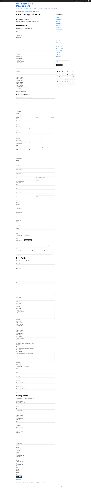
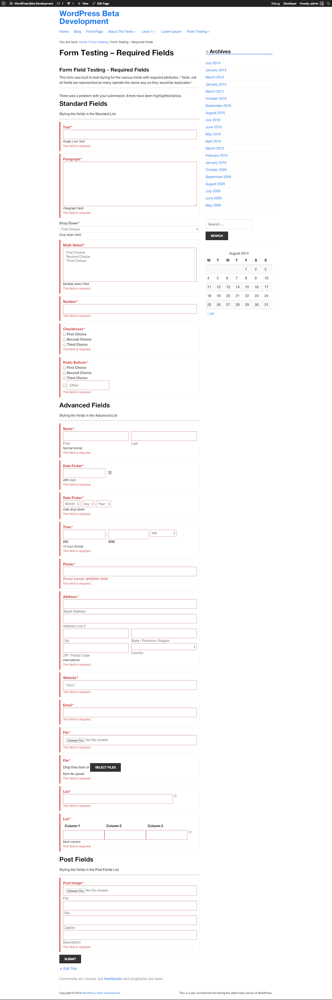
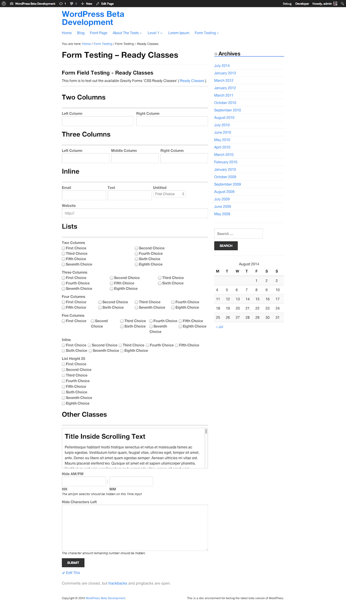
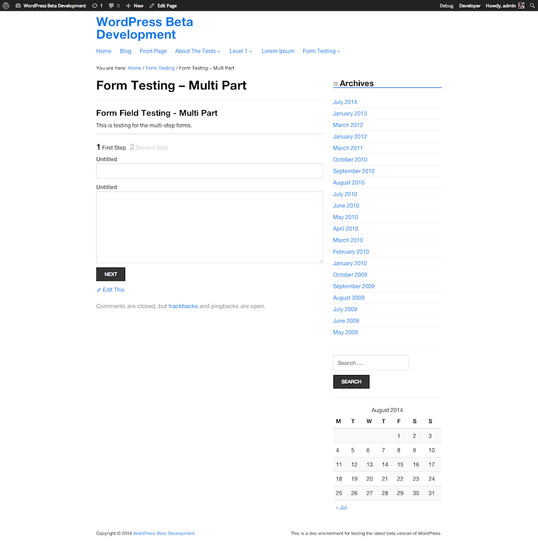

# Gravity Forms Sass

I love the Gravity Forms plugin for WordPress, but never cared for the excessive stylesheets and complicated selectors it introduced. This project aims to offer styling for GForms using Sass and minimal selectors.

## What is Covered

All of the defualt and advanced fields, as well as the Gravity Forms Ready Classes. Included in this repository are several form exports that contain a vast array of fileds and options I created for testing.

* All form fields
* Required fields
* Multi part form
* Ready classes

Though a few aspects are still in early stages of dev ;)

## Usage

Be sure to visit Forms -> Settings in your WordPress Dashboard and set **Output CSS** to **No**, optionally while you are there set **Output HTML5** to **Yes**. Save and go play.

This was setup running WordPress Version `4.0-beta2-20140801` and Gravity Forms Version `1.8.9`.

## Contribute

Want to help out? Awesome!

Please don't make pull requests against the `master` branch. This is the latest, stable code. You can make a pull request against the `dev` (future release) branch.

## TODO

Some parts of the styling still need to be addressed, 

1. Drop down and multiselect "enhanced UI"
2. Progress bar on multi select
3. Post Custom Fields - only tested "single line text" option
4. Check shipping various methods, only 1 allowed per form
5. More form settings, such as inline label placements
6. Organize structure, break up sections, import files from one
7. ...

Mostly this is a running list of what I intend to address

## Screenshots

Here is a visual overview or the basic styling offeres thus far.

All Form Fields

Required Fields with Errors

Gravity Forms Ready Classes

Multi-Step Form

## Resources

Links 'n stuff

* [Gravity Forms](http://www.gravityforms.com/)
* [Gravity Forms Ready Classes](http://www.gravityhelp.com/documentation/page/CSS_Ready_Classes)
* Say hi on Twitter [@ryanolson](http://twitter.com/ryanolson)

## Changelog

### Version 1.0.0

* Brand new, let's get this party started.